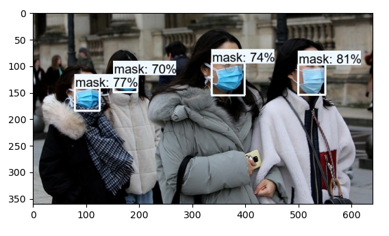
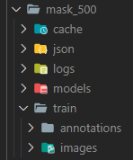

<p align="center">
  <a href="https://fulcrum.rocks/" target="blank"></a>
</p>
  <H1 align="center"><a href="https://blog.fulcrum.rocks/neural-network-image-recognition" target="blank">How to Create Neural Network for Recognizing Masks</a></br>[Part2] - Training & recognition</H1>

## Description

<p>Neural network that could process images, video footage and recognize people wearing masks</p>

## Parts

<a href="https://github.com/fulcrum-rocks/image-recognition-labeling" target="blank">[Part1] - Labeling</a>

<a href="https://github.com/fulcrum-rocks/image-recognition" target="blank">[Part2] - Training & recognition</a>



## Tech stack:

1. Python 3.6+
2. Tensorflow 2 nightly
3. OpenCV-python
4. Modified YoloV3

## Installation

```bash
$ activate yolo3 # in linux "source activate yolo3"
(yolo3) $ pip install -r requirements.txt
(yolo3) $ pip install -e .
```

## Running the app

```bash
// ==================== Training ========================
python src/train_eager.py -c configs/mask_500.json

// ==================== Picture =========================
python src/pred.py -c configs/mask_500.json -i imgs/1.jpg

// ===================== Video ==========================
python video.py -c configs/mask_500.json -i video.mp4

// ==================== Benchmark =======================
python src/eval.py -c configs/mask_500.json
```

## Dataset Structure:

<p>dataset/</br></p>

<a href="https://pjreddie.com/media/files/yolov3.weights" target="blank">Link to default yolo.weights</a>
